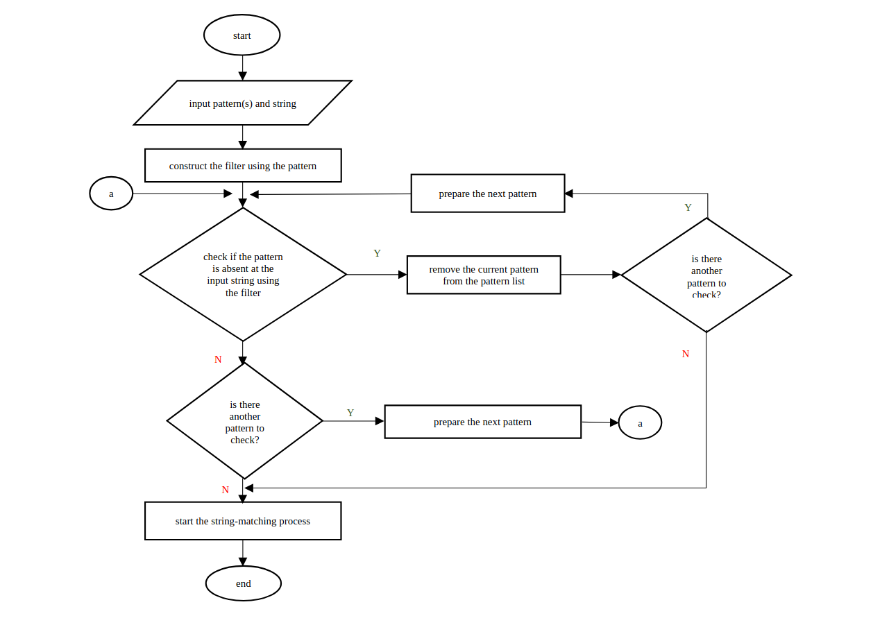
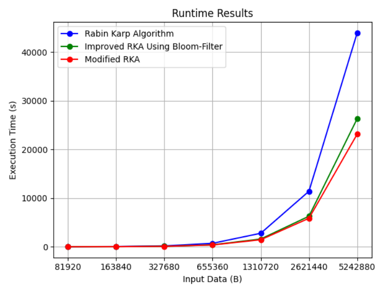
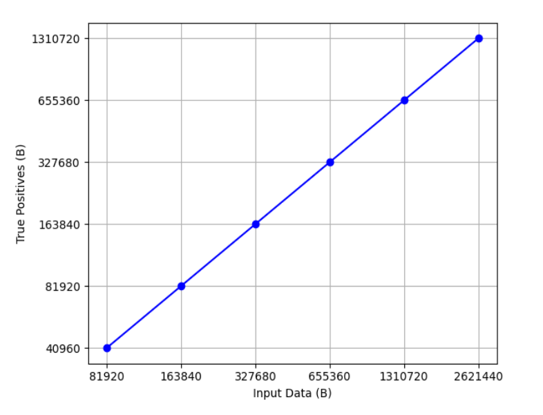
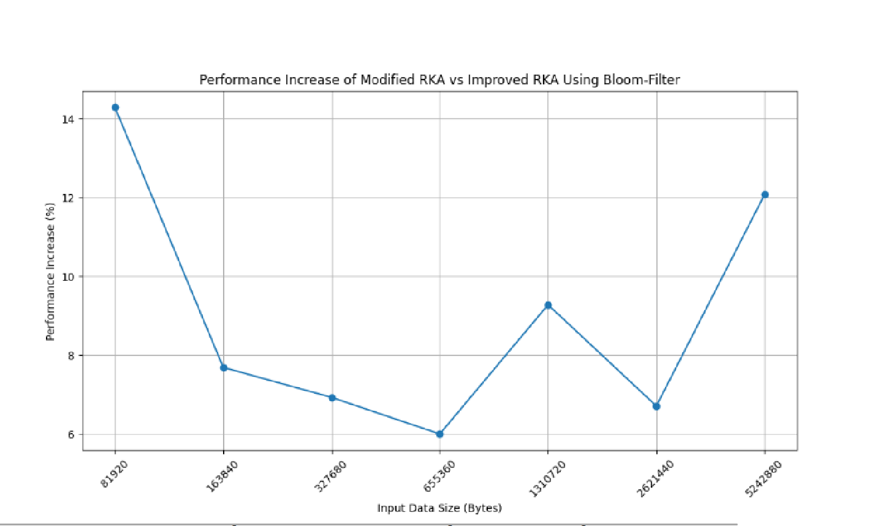

#  Enhancement of Rabin-Karp Algorithm Using XOR Filter

## Abstract
This repository presents an enhancement to the classic Rabin-Karp string-matching algorithm by integrating the XOR Filter, a probabilistic data structure known for its speed and low memory consumption (Martinez and Larrabeiti, 2024). The proposed method aims to optimize the runtime performance of the Rabin-Karp algorithm, particularly in large-scale data scenarios, by reducing unnecessary computations and memory calls. Comparative analysis demonstrates that the enhanced algorithm achieves significant improvements in execution time over both the naïve Rabin-Karp and its variants utilizing Bloom filters.

## Literature Review
The Rabin-Karp algorithm, introduced by Michael O. Rabin and Richard M. Karp in 1987, is a string-matching technique that leverages hashing for efficient substring search. While effective, its performance can be further optimized using probabilistic data structures. Among these, the XOR Filter has emerged as a superior alternative to Bloom and Cuckoo filters, offering faster and more memory-efficient set membership checks (Graf and Lemire, 2020).


## Methodology
The enhancement involves constructing an XOR Filter during the preprocessing phase using the given patterns. Patterns absent from the input data are filtered out, reducing the number of comparisons required. The Rabin-Karp algorithm is then applied to the remaining patterns, utilizing both hash and XOR checks to efficiently identify matches. This dual-filtering approach minimizes computational overhead and accelerates the string-matching process.

#### Algorithm Steps
1. Construct the XOR Filter with the provided patterns.
2. Remove patterns not present in the input data using the filter.
3. Apply the Rabin-Karp algorithm with XOR verification to the filtered patterns.
4. Return the starting indices of all exact matches found in the input text.

------------
#### Table

**Table 1. List of Execution Time for the Naïve RKA, Target Algorithm, and the Enhanced Algorithm**

| Input Data (B) | Rabin-Karp Algorithm | Improved RKA Using Bloom Filter | Modified Rabin-Karp Algorithm |
|:--------------:|:-------------------:|:-------------------------------:|:-----------------------------:|
| 81,920         | 11                  | 7                               | 6                             |
| 163,840        | 46                  | 26                              | 24                            |
| 372,680        | 182                 | 101                             | 94                            |
| 655,360        | 712                 | 400                             | 376                           |
| 1,310,720      | 2,775               | 1,595                           | 1,447                         |
| 2,621,440      | 11,403              | 6,275                           | 5,854                         |
| 5,242,880      | 43,920              | 26,297                          | 23,120                        |


**Figure 1. Flowchart of the Enhanced Method**




**Figure 2. Runtime Results per Input Data**




**Figure 3. Number of True Positive Patterns per Input Data**




**Figure 4. Percentage of the Increased Performance of the Enhanced Algorithm Compared to the Naïve Rabin-Karp Algorithm**


**Figure 5. Percentage of the Increased Performance of the Enhanced Algorithm Compared to the Improved Rabin-Karp Using Bloom-Filter**



## Results and Discussion
Empirical evaluation using randomly generated strings of varying lengths (from 81,920 to 5,242,880 bits) demonstrates that the enhanced algorithm consistently outperforms both the naïve Rabin-Karp and its Bloom filter variant. On average, the proposed method achieves a 47.53% improvement in runtime over the baseline and a 9% improvement over the Bloom filter approach. These results underscore the practical suitability of the enhanced algorithm for real-world applications requiring efficient pattern matching in massive datasets.

## Usage
The implementation is provided in Python. To use the enhanced Rabin-Karp algorithm with XOR filter:

```python
from rabin_karp_xor import rabin_karp_xor_search

text = "ababcabcabababd"
pattern = "ababd"
result = rabin_karp_xor_search(pattern, text)
print(result)  # Output: [10]
```


## References
- Escoto, B., Ladines, A., Macahilig, A., Mercado, M., Cortez, D., Dioses, R., Morano, J., & Guialil, J. (2024). Enhancement of Rabin-Karp Algorithm using XOR Filter. International Journal Of Computing Sciences Research, 8, 3088-3102.
- Martinez, J., & Larrabeiti, D. (2024). [Reference on XOR Filter performance]
- Graf, D., & Lemire, D. (2020). [Evaluation of Bloom, Cuckoo, and XOR Filters]
- Luo, et al. (2020). [Bloom Filter Applications]
- Fan, et al. (2014). [Cuckoo Filter]
- Putri, R. & Siahaan, D. (2017). [Rabin-Karp Algorithm Study]
- Leman, Rahman, Ikorasaki, Riza, & Akbbar (2019). [Rabin-Karp Algorithm Analysis]
- Singh, et al. (2020). [Probabilistic Data Structures]

---
> *This repository and its documentation are intended for academic and research purposes, providing a foundation for further exploration and optimization of pattern-matching algorithms using advanced probabilistic data structures.*
